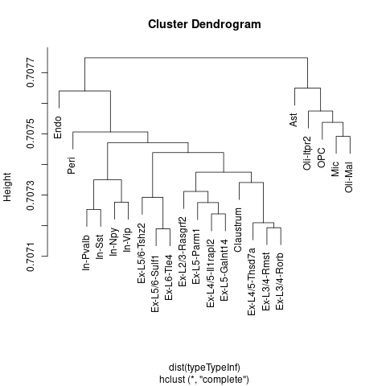
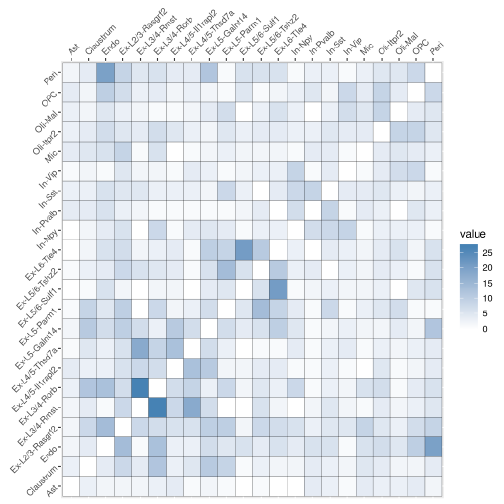

 CellWalker Walkthrough
================

This is a walkthrough of running CellWalker on SNARE-seq data generated in the paper "High-throughput sequencing of the transcriptome and chromatin accessibility in the same cell." Running this code requires the following packages for R: "data.table", "Matrix", "ggplot2", "TxDb.Mmusculus.UCSC.mm10.knownGene", and "org.Mm.eg.db."

First, load the scATAC-seq data in the form of a cell-by-peak matrix (available from GEO accession: GSE126074)

``` r
ATAC_Barcodes = fread("GSE126074_AdBrainCortex_SNAREseq_chromatin.barcodes.tsv.gz", header=FALSE)$V1
ATAC_Peaks = fread("GSE126074_AdBrainCortex_SNAREseq_chromatin.peaks.tsv.gz", header=FALSE)$V1
ATAC_Mat = readMM("GSE126074_AdBrainCortex_SNAREseq_chromatin.counts.mtx.gz")
rownames(ATAC_Mat) = ATAC_Peaks
colnames(ATAC_Mat) = ATAC_Barcodes
ATAC_Mat = ATAC_Mat>0 #binarize
```

Next, load a list of marker genes for cell types. These are provided in Supplementary Table 1 of the SNARE-seq paper. We will use this for our label nodes.

``` r
RNA_markers = fread("adult_cerebral_cortex_markers.csv")
cellTypes = names(table(RNA_markers$Cluster))
```

Given a list of label nodes, we need to compute weights of edges from these nodes to the scATAC-seq cells (label-to-cell edge weights). In this case, we'll compute the fraction of scATAC-seq reads in each cell that overlap marker genes for each cell type. Note that this particular function is only to test mm10 peaks. In general, the only requirement is that cells\_in\_markers have dimension c-by-l where c is the number of cells and l is the number of label nodes.

``` r
cells_in_markers = compute.fraction_marker(cellTypes, RNA_markers, ATAC_Mat)
```

Next, we compute the Jaccard similarity between all cells (cell-to-cell edge weights) to generate a matrix of dimension c-by-c.

``` r
distMat = jaccard(t(ATAC_Mat))
```

Now we diffuse information over the combined network. For this walkthrough we test possible edge weights between 10<sup>−2</sup> and 10<sup>4</sup> and compute cell homogeneity at each weight to evaluate performance. Note that with many cell types cell homogeneity can be slow to compute (this section may take several hours to run).

``` r
i = length(cellTypes)
cellHomogeneityList = list()
cellTypeInfList = list()
typeTypeInfList = list()
cellLabelList = list()
for(weight in 10^seq(-2,4,1)){
    #combined graph
    simMat = combine.graph(cells_in_markers, distMat, weight)
    
    #compute influence with random walk
    infMat = random.walk(simMat)

    #Label-to-cell influence
    cellTypeInf = as.matrix(infMat[-(1:i),(1:i)])
    colnames(cellTypeInf) = cellTypes

    #Label-to-label influence
    typeTypeInf = as.matrix(infMat[(1:i),(1:i)])
    colnames(typeTypeInf) = cellTypes
    rownames(typeTypeInf) = cellTypes

    #normalize label-to-cell scores for ranking
  labelsAdj = apply(cellTypeInf, 2, function(x) (x-mean(x))/sd(x))
  labelsAdj = apply(labelsAdj, 2, function(x) x/max(x))
  labelsAdjType = apply(labelsAdj, 1, function(x) cellTypes[order(x, decreasing = TRUE)][1])
    
  #compute cell homogeneity and store portions of information matrix
  infMat = as.matrix(infMat)
  cellHomogeneityList[[as.character(weight)]] =  compute.cell.homogeneity(cellTypes, labelsAdjType, infMat)
  cellTypeInfList[[as.character(weight)]] = labelsAdj
  typeTypeInfList[[as.character(weight)]] = typeTypeInf
  cellLabelList[[as.character(weight)]] = labelsAdjType
}
```

Plot cell homogeneity across edge weights:

``` r
require("ggplot2")
cellHomogeneityScores = unlist(cellHomogeneityList)
ggplot() + geom_line(aes(10^seq(-2,4,1), cellHomogeneityScores)) + scale_x_log10() + scale_y_log10() + theme_classic() + ylab("Predicted Cell Homogeneity") + xlab("Label Edge Weight")
```


Select the optimal edge weight:

``` r
weight = as.character(10^seq(-2,4,1)[order(cellHomogeneityScores, decreasing=TRUE)[1]])
```

Let's take a look at the hierarchical clustering of cell types based on label-to-label influence. This will show us how information was propagated from labels to other labels via cells.

``` r
typeTypeInf = typeTypeInfList[[weight]]
plot(hclust(dist(typeTypeInf)))
```



We can use label-to-cell influence to see how well each label corresponds to each cell. Some cells will be hard to label because they are nearly equally influenced by two different labels. We can take a look at which labels are often confused for each other.

``` r
cellTypeInf = cellTypeInfList[[weight]]
uncertainMat = compute.uncertain.labels(cellTypes, cellTypeInf)
uncertainMatMelt = melt(uncertainMat)
uncertainMatMelt$Var1 = factor(uncertainMatMelt$Var1, levels = cellTypes)
uncertainMatMelt$Var2 = factor(uncertainMatMelt$Var2, levels = cellTypes)
ggplot(uncertainMatMelt, aes(Var1, Var2)) + geom_tile(aes(fill = value), colour = "black") +scale_fill_gradient(low = "white",high = "steelblue") + theme(axis.text.x = element_text(angle = 45, hjust=0), axis.title.x=element_blank(), axis.text.y = element_text(angle = 45), axis.title.y=element_blank()) + scale_x_discrete(position = "top") 
```



In this dataset we see that the different types of excitatory neurons are the hardest to distinguish from each other, though this uncertainty mostly arises between neurons in neighboring layers.

Finally, we can label all cells based on the top labels for each cell:

``` r
cellLabels = cellLabelList[[weight]]
```
