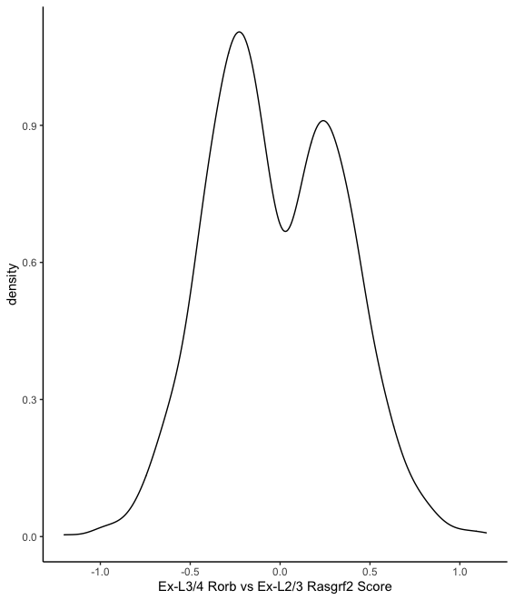

 CellWalker Walkthrough
================

This is a walkthrough of running CellWalker (described [here](https://www.biorxiv.org/content/10.1101/847657v2.full)) on SNARE-seq adult brain data generated in the paper "High-throughput sequencing of the transcriptome and chromatin accessibility in the same cell." Running this code requires the following packages for R: "data.table," "Matrix," "ggplot2," "TxDb.Mmusculus.UCSC.mm10.knownGene," and "org.Mm.eg.db."

The SNARE-seq data for adult and developing brain analyzed in the CellWalker paper are available from GEO accession number GSE126074. For other data analyzed in the paper: the 10x Single Cell Multiome ATAC + Gene Exp data for human healthy brain is [available from 10x after registration](https://support.10xgenomics.com/single-cell-multiome-atac-gex/datasets/1.0.0/human_brain_3k), and the scATAC-seq data on the developing human brain is a part of psychENCODE and is available to consortium members from synapse (synapse.org id [syn21392931](https://www.synapse.org/#!Synapse:syn21392931), not yet publically released).

First, load the scATAC-seq data in the form of a cell-by-peak matrix

``` r
ATAC_Barcodes = fread("GSE126074_AdBrainCortex_SNAREseq_chromatin.barcodes.tsv.gz", header=FALSE)$V1
ATAC_Peaks = fread("GSE126074_AdBrainCortex_SNAREseq_chromatin.peaks.tsv.gz", header=FALSE)$V1
ATAC_Mat = readMM("GSE126074_AdBrainCortex_SNAREseq_chromatin.counts.mtx.gz")
rownames(ATAC_Mat) = ATAC_Peaks
colnames(ATAC_Mat) = ATAC_Barcodes
ATAC_Mat = ATAC_Mat>0 #binarize
```

Next, load a list of marker genes for cell types. These are provided in [Supplementary Table 1](https://www.ncbi.nlm.nih.gov/pmc/articles/PMC6893138/bin/NIHMS1539957-supplement-sup_tab1.xlsx) of the SNARE-seq paper. We will use this for our label nodes.

``` r
RNA_markers = fread("adult_cerebral_cortex_markers.csv")
cellTypes = names(table(RNA_markers$Cluster))
```

Given a list of label nodes, we need to compute weights of edges from these nodes to the scATAC-seq cells (label-to-cell edge weights). In this case, we'll compute the fraction of scATAC-seq reads in each cell that overlap marker genes for each cell type. Note that this particular function is only to test mm10 peaks. In general, the only requirement is that cells\_in\_markers have dimension c-by-l where c is the number of cells and l is the number of label nodes. Thus, the cell-by-gene matrices outputted by SnapATAC, CICERO, and ArchR can be used to generate label edges.

``` r
cells_in_markers = compute.fraction_marker(cellTypes, RNA_markers, ATAC_Mat)
```

Next, we compute the Jaccard similarity between all cells (cell-to-cell edge weights) to generate a matrix of dimension c-by-c.

``` r
distMat = jaccard(t(ATAC_Mat))
```

Now we diffuse information over the combined network. For this walkthrough we test possible edge weights between 10<sup>−2</sup> and 10<sup>4</sup> and compute cell homogeneity at each weight to evaluate performance. For 10,000 cells CellWalker takes about 8 minutes to run for a single edge weight on a personal computer using one core.

``` r
i = length(cellTypes)
cellHomogeneityList = list()
cellTypeInfList = list()
typeTypeInfList = list()
cellLabelList = list()
for(weight in 10^seq(-2,4,1)){
    #combined graph
    simMat = combine.graph(cells_in_markers, distMat, weight)
    
    #compute influence with random walk
    infMat = random.walk(simMat)

    #Label-to-cell influence
    cellTypeInf = as.matrix(infMat[-(1:i),(1:i)])
    colnames(cellTypeInf) = cellTypes

    #Label-to-label influence
    typeTypeInf = as.matrix(infMat[(1:i),(1:i)])
    colnames(typeTypeInf) = cellTypes
    rownames(typeTypeInf) = cellTypes

    #normalize label-to-cell scores for ranking
  labelsAdj = apply(cellTypeInf, 2, function(x) (x-mean(x))/sd(x))
  labelsAdj = apply(labelsAdj, 2, function(x) x/max(x))
  labelsAdjType = apply(labelsAdj, 1, function(x) cellTypes[order(x, decreasing = TRUE)][1])
    
  #compute cell homogeneity and store portions of information matrix
  infMat = as.matrix(infMat)
  cellHomogeneityList[[as.character(weight)]] =  compute.cell.homogeneity(cellTypes, labelsAdjType, infMat)
  cellTypeInfList[[as.character(weight)]] = labelsAdj
  typeTypeInfList[[as.character(weight)]] = typeTypeInf
  cellLabelList[[as.character(weight)]] = labelsAdjType
}
```

Plot cell homogeneity across edge weights:

``` r
require("ggplot2")
cellHomogeneityScores = unlist(cellHomogeneityList)
ggplot() + geom_line(aes(10^seq(-2,4,1), cellHomogeneityScores)) + scale_x_log10() + scale_y_log10() + theme_classic() + ylab("Predicted Cell Homogeneity") + xlab("Label Edge Weight")
```


Select the optimal edge weight:

``` r
weight = as.character(10^seq(-2,4,1)[order(cellHomogeneityScores, decreasing=TRUE)[1]])
```

Let's take a look at the hierarchical clustering of cell types based on label-to-label influence. This will show us how information was propagated from labels to other labels via cells.

``` r
typeTypeInf = typeTypeInfList[[weight]]
plot(hclust(dist(typeTypeInf)))
```


We can use label-to-cell influence to see how well each label corresponds to each cell. Some cells will be hard to label because they are nearly equally influenced by two different labels. We can take a look at which labels are often confused for each other.

``` r
cellTypeInf = cellTypeInfList[[weight]]
uncertainMat = compute.uncertain.labels(cellTypes, cellTypeInf)
uncertainMatMelt = melt(uncertainMat)
uncertainMatMelt$Var1 = factor(uncertainMatMelt$Var1, levels = cellTypes)
uncertainMatMelt$Var2 = factor(uncertainMatMelt$Var2, levels = cellTypes)
ggplot(uncertainMatMelt, aes(Var1, Var2)) + geom_tile(aes(fill = value), colour = "black") +scale_fill_gradient(low = "white",high = "steelblue") + theme(axis.text.x = element_text(angle = 45, hjust=0), axis.title.x=element_blank(), axis.text.y = element_text(angle = 45), axis.title.y=element_blank()) + scale_x_discrete(position = "top") 
```


In this dataset we see that the different types of excitatory neurons are the hardest to distinguish from each other, though this uncertainty mostly arises between neurons in neighboring layers.

Finally, we can label all cells based on the top labels for each cell:

``` r
cellLabels = cellLabelList[[weight]]
```

Now that we have generated and evaluated our influence matrix, we can use it for some further downstream analysis. For example, in the confusion matrix we often see that two types of level 3/4 excitatory neuron are often confused for each other. Thanks to CellWalker's "fuzzy" cell labeling, we can investigate if they have distinct influence profiles.

``` r
l34Score = compare.types("Ex-L3/4-Rorb", "Ex-L3/4-Rmst", cellLabels, cellTypes, cellTypeInf)
ggplot() + geom_density(aes(l34Score)) + xlab("Ex-L3/4 Rorb vs Rmst Score")
```


It appears that for these two cell types it is difficult to identify distinct chromatin profiles. For comparsion, we can see that level 3/4 excitatory neurons are distinct from level 2/3 excitatory neurons.

``` r
l34_23Score = compare.types("Ex-L3/4-Rorb", "Ex-L2/3-Rasgrf2", cellLabels, cellTypes, cellTypeInf)
ggplot() + geom_density(aes(l34_23Score)) + xlab("Ex-L3/4 Rorb vs Ex-L2/3 Rasgrf2 Score")
```



We can also examine if the accessibility genomic loci varies in a cell type-specific manner. For example, lets look at that second set of excitatory neurons in the context of mouse cortex topologically associated domains (TADs) from [Dixon et al.](http://chromosome.sdsc.edu/mouse/hi-c/download.html) (GEO accession number GSE35156).

``` r
TADRanges = fread("total.combined.domain")
TADRanges = GRanges(TADRanges$V1, IRanges(TADRanges$V2,TADRanges$V3))
ATAC_Mat = as.matrix(ATAC_Mat) #desparsify matrix for faster calculations
l34_TADCor = correlate.TADS(TADRanges, "Ex-L3/4-Rorb", "Ex-L3/4-Rmst", l34Score, cellLabels, ATAC_Mat, ATAC_Peaks)
ggplot() + geom_density(aes(l34_TADCor)) + xlab("Ex-L3/4 Rorb vs Rmst Score - Accessibility Correlation in TADs")
```


In this case, unlike in the CellWalker paper testing developmental time points, we do not see any biomodality in TAD associations with these two cell types, indicating these labels are not correlated or anti-correlated with this set of cortical TADs.

Another downstream use of the influence matrix is scoring bulk-derived data with labels based on the cell-to-label influence scores. This can for example be used to assign cell type-specific labels to enhancers or transcription factors. First, we will label all Vista enhancers for the mouse forebrain (ENCODE id ENCFF225JUL).

``` r
Vista_forebrain = fread("ENCFF225JUL.bed.gz")
Vista_forebrain = GRanges(Vista_forebrain$V1, IRanges(Vista_forebrain$V2,Vista_forebrain$V3))
enhancer_labels = labelBulk(Vista_forebrain, infMat, ATAC_Mat, ATAC_Peaks, cellType)
enhancer_labels = enhancer_labels[!is.na(labeledEnhancers)] # some can't me mapped due to no overlap between bulk and single cell data
ggplot() + geom_bar(aes(enhancer_labels)) + xlab("Cell Type") + theme(axis.text.x = element_text(angle = 90, hjust = 1, vjust=.5))
```


A transcription factor can be labeled similarly, using a list of the regions it binds to in bulk data. This is done by calling labelBulk on a GRangesList (e.g. `labelBulk(GRangesList(binding_sites), infMat, ATAC_Mat, ATAC_Peaks, cellType)`) returns a single label that best corresponds to the full list of binding peaks. However, we don't yet recommend this functionality as we hypothesize that these results are often driven in part by dominant cell types within the bulk samples. Thus we can establish transcription factors as positives for asigned cell types, but we cannot be sure about false negatives.
